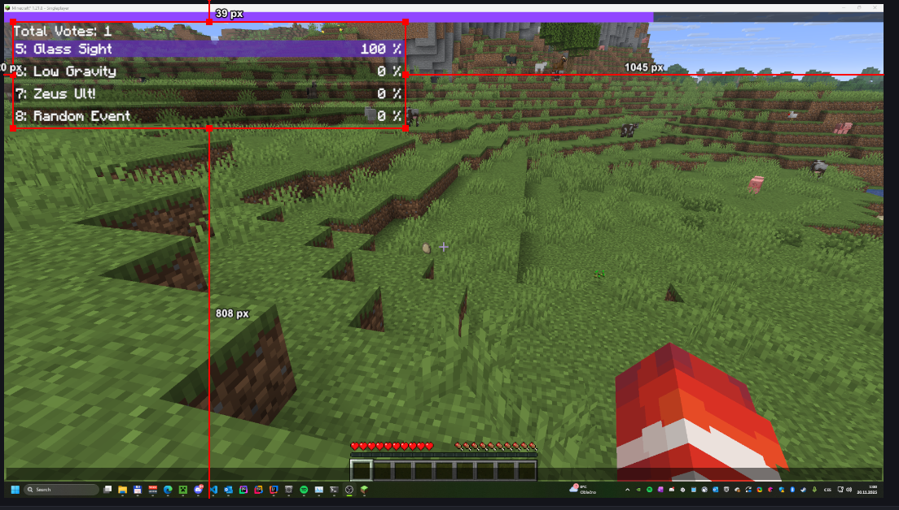
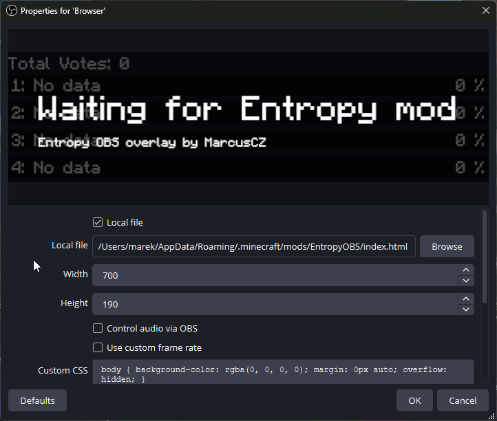

## Entropy OBS Voting Layout

This mod creates a HTML layout for OBS for showing Entropy voting events. The HTML layout replaces the default Entropy rendered layout, no further setup is required.

### Adding layout to OBS

1. Launch this mod in Minecraft to generate the HTML file.
2. Open OBS Studio.
3. From add sources choose Browser
4. Check Local File
5. Browse to the `index.html` file in your `.minecraft/mods/EntropyOBS` folder
6. Optional: Set width to 700 and height to 190 for crop to fit the layout better.
7. Move the layout to your desired position in your OBS scene.
8. Once you join a Minecraft world the layout will automatically connect to your Entropy client.

